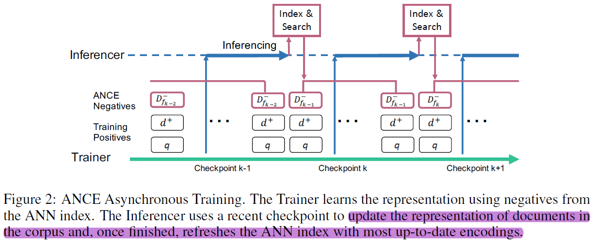

# Approximate Nearest Neighbor Negative Contrastive Learning for Dense Text Retrieval

This repo provides personal implementation of paper [Approximate Nearest Neighbor Negative Contrastive Learning for Dense Text Retrieval](https://arxiv.org/pdf/2007.00808.pdf) in a simplified way. The code is refered to official version of [ANCE](https://github.com/microsoft/ANCE).

<p align="center">
  
  <br>
  <b>Figure 1.</b> ANCE Asynchronous Training
</p>

## TODO List
- [x] Data download and proprecessing
- [x] Model training (MS MARCO)
- [x] ANN data generation (MS MARCO)
- [x] Model inference
- [x] Warmup training
- [ ] Model training (OpenQA)
- [ ] ANN data generation (OpenQA)

## Environment
```bash
'transformers==2.3.0' 
'pytrec-eval'
'faiss-cpu'
'wget'
'python==3.6.*'
```
## Data Preparation
If raw data or preprocessed data has been existed, the relevant processing will be skipped. 
The architecture of data is as follows:
```bash
ANCE
|--data
    |--MSMARCO
        |--doc        # raw data
        |--passage    # raw data
        |--ann_data_* # preprocessed data (*_split* files have been removed)
    |--NQ_TQA
        |--checkpoint
        |--data
        |--ann_data_* # preprocessed data
```
**Download Dataset**
```bash
python data/download_data.py
```

**MS MARCO (Passage | Document)**
```bash
python data/msmarco_data.py 
        --data_dir raw_data_dir \
        --out_data_dir preprocessed_data_dir \ 
        --model_type {use rdot_nll for ANCE FirstP, rdot_nll_multi_chunk for ANCE MaxP} \ 
        --model_name_or_path roberta-base \ 
        --max_seq_length {use 512 for ANCE FirstP, 2048 for ANCE MaxP} \ 
        --data_type {use 1 for passage, 0 for document}
```
**OpenQA (NQ | TriviaQA)**
```bash
python data/dpr_data.py 
        --out_data_dir preprocessed_data_dir \ 
        --model_type dpr \ 
        --model_name_or_path bert-base-uncased \ 
        --max_seq_length 256 \ 
        --data_type {use 2 for both, 1 for trivia, 0 for nq}
        --question_dir raw_data_dir/raw_qna_question_data
        --wiki_dir raw_data_dir/wiki_corpus
        --answer_dir raw_data_dir/raw_qna_answers_data
```

## Training
To train dense retrieval (DR) model(s), e.g. BERT-Siamese, that encodes the query or document to *dense embeddings*. Please start four commands in the following order:

**[1]. run `train_bm25_warmup.py` to train BM25 model as pretrained model which will be used to generate initial ANN data (step [2]), termed warmup processing.**
```bash
python -m torch.distributed.launch --nproc_per_node=1 
        train_bm25_warmup.py \
        --train_model_type rdot_nll \
        --model_name_or_path roberta-base \
        --task_name MSMarco \
        --do_train \
        --evaluate_during_training \
        --data_dir {location of your raw data}  
        --max_seq_length 128 
        --per_gpu_eval_batch_size=256 \
        --per_gpu_train_batch_size=32 \
        --learning_rate 2e-4  \
        --logging_steps 100   \
        --num_train_epochs 2.0  \
        --output_dir {location for checkpoint saving} \
        --warmup_steps 1000  \
        --overwrite_output_dir \
        --save_steps 30000 \
        --gradient_accumulation_steps 1 \
        --expected_train_size 35000000 \
        --logging_steps_per_eval 1 \
        --fp16 \
        --optimizer lamb \
        --log_dir ~/tensorboard/{DLWS_JOB_ID}/logs/OSpass
```
**[2]. run `ann_data_gen.py` to initial ANN data generation, this step will use the pretrained BM25 warmup checkpoint (step [1]) to generate the initial training data. The command is as follow:**
```bash
python -m torch.distributed.launch --nproc_per_node=gpu_no 
        ann_data_gen.py \
        --training_dir {model checkpoint location} \ # if it is not existed, it will be pretrained checkpoint location automatically. 
        --init_model_dir {pretrained BM25 warmup checkpoint location} \ 
        --model_type rdot_nll \
        --output_dir model_ann_data_dir \
        --cache_dir model_ann_data_dir_cache \
        --data_dir preprocessed_data_dir \
        --max_seq_length 512 \
        --per_gpu_eval_batch_size 16 \
        --topk_training {top k candidates for ANN search(ie:200)} \ 
        --negative_sample {negative samples per query(20)} \ 
        --end_output_num 0 # only set as 0 for initial data generation, do not set this otherwise
```
**[3]. run `train_bert_ance.py` to start train dense retrieval (DR) model with ANCE Negatives sampleing strategy. ANCE training will use the most recently generated ANN data, the command is as follow:**
```bash
python -m torch.distributed.launch --nproc_per_node=gpu_no 
        train_bert_ance.py 
        --model_type rdot_nll \
        --model_name_or_path pretrained_checkpoint_dir \
        --task_name MSMarco \
        --triplet {# default = False, action="store_true", help="Whether to run training}\ 
        --data_dir preprocessed_data_dir \
        --ann_dir {location of the ANN generated training data} \ 
        --max_seq_length 512 \
        --per_gpu_train_batch_size=8 \
        --gradient_accumulation_steps 2 \
        --learning_rate 1e-6 \
        --output_dir model_dir \
        --warmup_steps 5000 \
        --logging_steps 100 \
        --save_steps 10000 \
        --optimizer lamb 
```	
**[4]. Once training starts, start another job in parallel to fetch the latest checkpoint from the ongoing training and update the training data. To do that, run**
```bash
python -m torch.distributed.launch --nproc_per_node=gpu_no 
        ann_data_gen.py \
        --training_dir {model checkpoint location} \ # if it is not existed, it will be pretrained checkpoint location automatically. 
        --init_model_dir {pretrained checkpoint location} \ 
        --model_type rdot_nll \
        --output_dir model_ann_data_dir \
        --cache_dir model_ann_data_dir_cache \
        --data_dir preprocessed_data_dir \
        --max_seq_length 512 \
        --per_gpu_eval_batch_size 16 \
        --topk_training {top k candidates for ANN search(ie:200)} \ 
        --negative_sample {negative samples per query(20)} \ 
        --end_output_num 0 # only set as 0 for initial data generation, do not set this otherwise
```

## Inference
The command for inferencing query and passage/doc embeddings is the same as that for Initial ANN data generation described above as the first step in ANN data generation is inference. However you need to add --inference to the command to have the program to stop after the initial inference step. commands/run_inference.sh provides a sample command.

## Evaluation
The evaluation is done through "Calculate Metrics.ipynb". This notebook calculates full ranking and reranking metrics used in the paper including NDCG, MRR, hole rate, recall for passage/document, dev/eval set specified by user. In order to run it, you need to define the following parameters at the beginning of the Jupyter notebook.
```python        
checkpoint_path = {location for dumpped query and passage/document embeddings which is output_dir from run_ann_data_gen.py}
checkpoint =  {embedding from which checkpoint(ie: 200000)}
data_type =  {0 for document, 1 for passage}
test_set =  {0 for MSMARCO dev_set, 1 for TREC eval_set}
raw_data_dir = 
processed_data_dir = 
```
