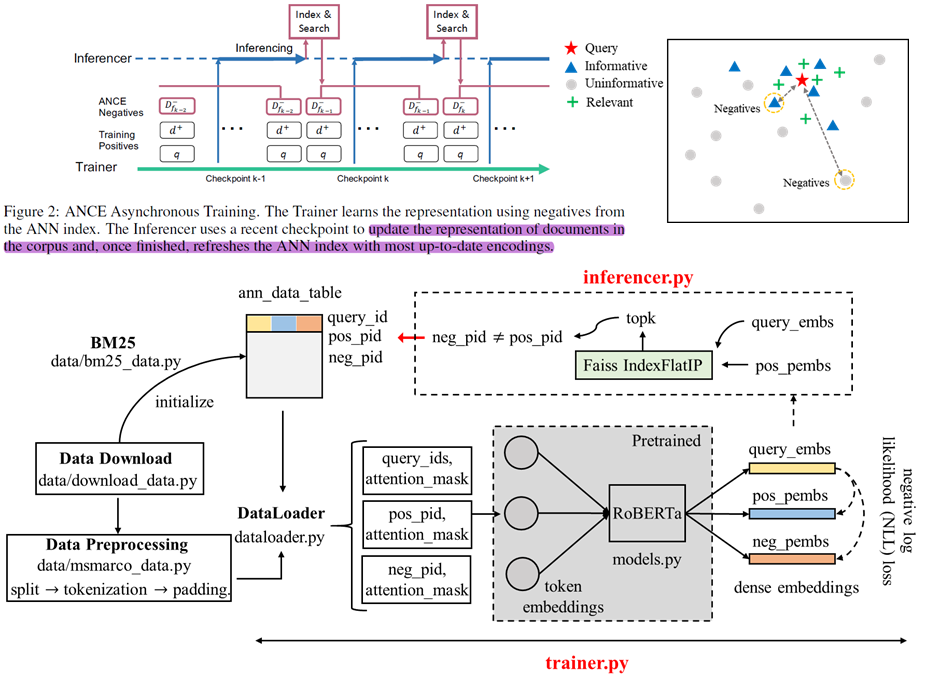

# Approximate Nearest Neighbor Negative Contrastive Learning for Dense Text Retrieval

This repo provides personal implementation of paper [Approximate Nearest Neighbor Negative Contrastive Learning for Dense Text Retrieval](https://arxiv.org/pdf/2007.00808.pdf) in a simplified way. The code is refered to official version of [ANCE](https://github.com/microsoft/ANCE).

<p align="center">
  
  <br>
  <b>Figure 1.</b> ANCE Asynchronous Training
</p>

The architecture of data is as follows:
```bash
ANCE
|--data
    |--MSMARCO
        |--doc        # raw data
        |--passage    # raw data
        |--ann_data_* # preprocessed data (*_split* files have been removed)
```

## Environment
```bash
'transformers==2.3.0' 
'scikit-learn' # if scikit-learn passage is not existed, it will occurs the bug of "ImportError: from transformers import glue_compute_metrics"
'tokenizers'
'apex' # use 16-bit (mixed) precision (through NVIDIA apex) instead of 32-bit
# git clone https://www.github.com/nvidia/apex
# cd apex
# python setup.py install
'pytrec-eval'
'faiss-cpu'
'python==3.6.*'
```
## Data Preparation
If raw data or preprocessed data has been existed, the relevant processing will be skipped. Note that raw data can be used for BM25 directly, but we need preprocessed data to train dense retrival (DR) model, e.g. BERT-Siamese.  
**Download Dataset**
```bash
python data/download_data.py
```

**MS MARCO (Passage | Document)**
```bash
python data/msmarco_data.py 
        --data_dir raw_data_dir \
        --out_data_dir preprocessed_data_dir \ 
        --model_type {use rdot_nll for ANCE FirstP, rdot_nll_multi_chunk for ANCE MaxP} \ 
        --model_name_or_path roberta-base \ 
        --max_seq_length {use 512 for ANCE FirstP, 2048 for ANCE MaxP} \ 
        --data_type {use 1 for passage, 0 for document}
```

## BM25 Initial ANN Data
```bash
python data/bm25_data.py
        --raw_data_dir raw_data_dir \
        --data_dir preprocessed_data_dir \
        --ann_dir ann_data_dir \
        --negative_sample {default=1}
```
## Trainer
To train dense retrieval (DR) model(s), e.g. BERT-Siamese, that encodes the query or document to *dense embeddings*. run `train_bm25_warmup.py` to train BM25 model as pretrained model which will be used to generate initial ANN data (step [2]), termed warmup processing. run `train_bert_ance.py` to start train dense retrieval (DR) model with ANCE Negatives sampleing strategy. ANCE training will use the most recently generated ANN data, the command is as follow:**
```bash
python -m torch.distributed.launch --nproc_per_node=1 
        train_bm25_warmup.py \
        --task_name MSMarco \
        --model_type rdot_nll \
        --model_name_or_path roberta-base \
        --data_dir {location of your preprocessed data}  
        --ann_dir {location of the ANN generated training data}
        --output_dir {location for checkpoint saving} \

        --evaluate_during_training \
        --max_seq_length 512 
        --per_gpu_eval_batch_size=256 \
        --per_gpu_train_batch_size=32 \
        --learning_rate 2e-4  \
        --logging_steps 100   \
        --num_train_epochs 2.0  \
        --warmup_steps 1000  \
        --overwrite_output_dir \
        --save_steps 30000 \
        --gradient_accumulation_steps 1 \
        --expected_train_size 35000000 \
        --logging_steps_per_eval 1 \
        --fp16 \
        --optimizer lamb \
        --log_dir ./tensorboard/logs/OSpass
        --data_type {use 1 for passage, 0 for document}
```
## Inferencer
run `ann_data_gen.py` to initial ANN data generation, this step will use the BM25 generate the initial training data. The command is as follow: Once training starts, start another job in parallel to fetch the latest checkpoint from the ongoing training and update the training data. To do that, run**
```bash
python -m torch.distributed.launch --nproc_per_node=gpu_no 
        ann_data_gen.py \
        --training_dir {model checkpoint location} \ # if it is not existed, it will be pretrained checkpoint location automatically. 
        --init_model_dir {pretrained BM25 warmup checkpoint location} \ 
        --model_type rdot_nll \
        --output_dir model_ann_data_dir \
        --cache_dir model_ann_data_dir_cache \
        --data_dir preprocessed_data_dir \
        --max_seq_length 512 \
        --per_gpu_eval_batch_size 16 \
        --topk_training {top k candidates for ANN search(ie:200)} \ 
        --negative_sample {negative samples per query(20)} \ 
        --end_output_num 0 # only set as 0 for initial data generation, do not set this otherwise
```

## Evaluation
The evaluation calculates full ranking and reranking metrics including **MRR, NDCG, Hole Rate, Recall** for passage/document. But dev/eval set should be specified by user. The detailed command is as follow:
```bash  
python eval_metrics.py      
        --raw_data_dir {The path of raw data dir} \
        --processed_data_dir {The path of preprocessed data dir} \
        --checkpoint_path {Location for dumpped query and passage/document embeddings which is output_dir} \
        --checkpoint {Embedding from which checkpoint(ie: 200000)} \
        --data_type {0 for document, 1 for passage} \
        --test_set {0 for dev_set, 1 for eval_set}
```